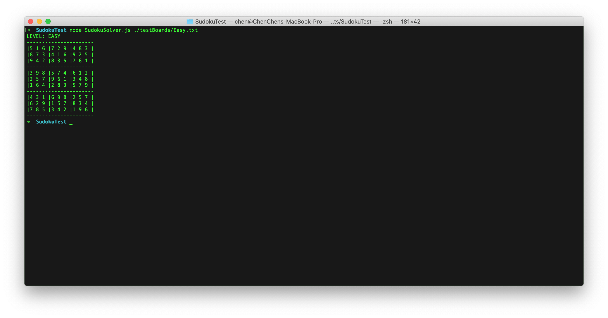

# Sudoku Solver

## Description
This is a sudoku solver using the backtracking algorithm. It reads from a txt file and tries to solve the board recursively.

## Run
### To run the solver
```
# To solve an easy board
node SudokuSolver.js ./testBoards/Easy.txt
# To solve a hard board
node SudokuSolver.js ./testBoards/Hard.txt 
 # Try an unsolvable board
node SudokuSolver.js ./testBoards/Unsolable.txt
# try other boards
node SudokuSolver.js ./testBoards/... 
```
## Tests
The written test plan is located here: ./tests/TestPlan.txt
### To run the Unit tests
```
mocha ./tests/SudokuSolver.test.js 
```
### To run the Integrated tests
```
./RunIntTests.sh
```
NOTE: the test results are redirected in result.txt

## Further Implementation
### Complexity (difficulty) calculation
Currently the method to calculate the complexity of the sudoku board is to count the number of tempted placement while running the program, and by using the examples of easy and hard (medium) board we chose a boudary that is suitable to determine the complexity of the board.

_To calculate the complexity more thoroughly and scientifically, we can analyse the models that defines the sudoku board difficulties (to see detailed info: https://www.sudokuwiki.org/sudoku.htm) to find the baselines of difficulty categories, and then compare the sudoku board with the models, categorize the board._

### Automation test implementation
In integrated test program, we only implemented the most representive test cases in the two test groups. More test cases can be written based on the test plan. Also the test plan program can be simplified and/or refactored.

## Credits
* some of the examples in the testBoards directory are from http://sudopedia.enjoysudoku.com/Test_Cases.html